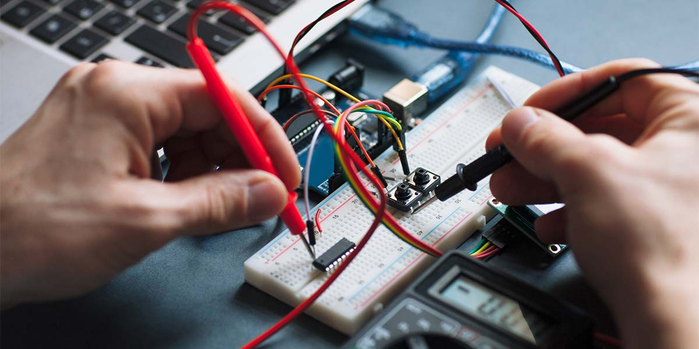
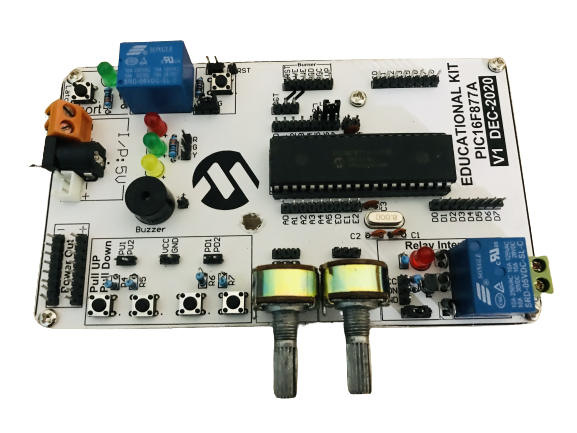
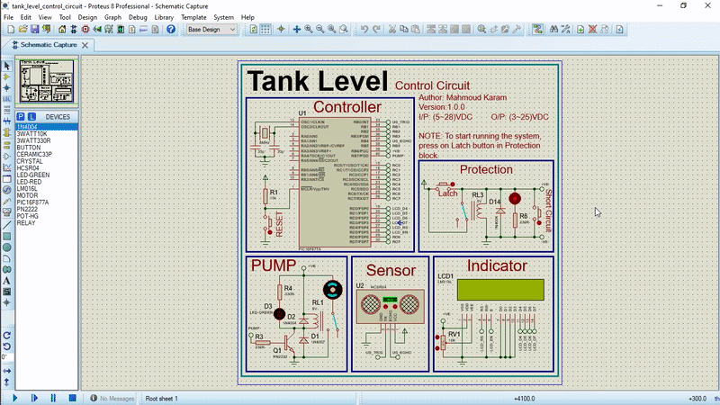
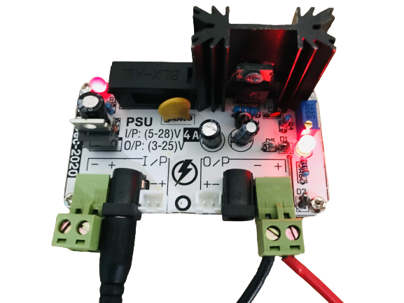
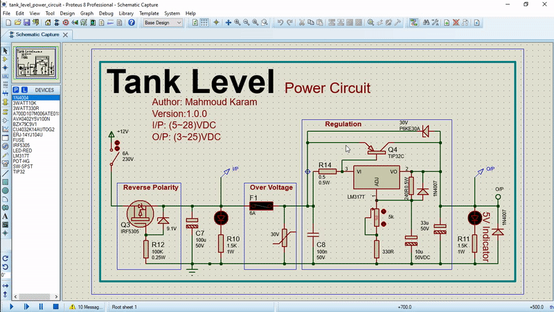
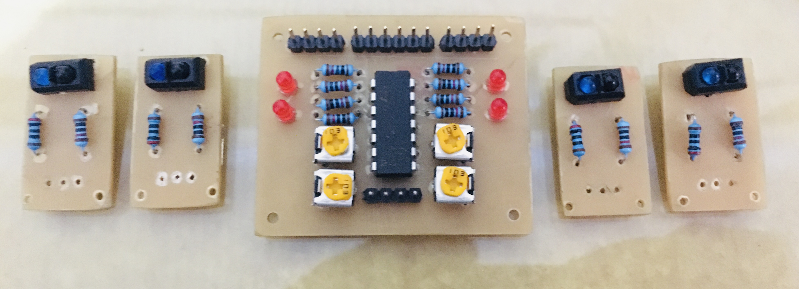

<h1 align="center">Electronics Projects</h1>

  

  

---

## 🔑 Introduction

This repository contains some of the electronics projects I have done during my time at the University.

The projects are **open source** and you can use it for your own projects.

## Table of Contents

- [🔑 Introduction](#-introduction)
- [Table of Contents](#table-of-contents)
- [Repo Hierarchy](#repo-hierarchy)
- [🎯 Samples](#-samples)
- [💁‍♂️ Contribute](#️-contribute)
- [📞 Contact me](#-contact-me)
- [🔓 Licenses](#-licenses)
- [🔏 Credits](#-credits)

---

## Repo Hierarchy

**The Repo contains:**

* **[assets](assets/)**: Contains some helper files used in documentation of this repo.
* **[circuits](circuits/)**: Contains electronic circuits to be used in larger projects.
* **[simulation](simulation/)**: Contains electronics projects.

**Projects & Circuits consists of:**

* Simulation files using either Proteus or Multisim
* PCB files using either Eagle or Altium
* Electrical Analysis of the circuit
* Resources for the circuit or project

---

## 🎯 Samples

The following are some of the projects and circuits.

**NOTE**: Click on the proteus images below to start the animation.

1. **PIC16F877A Microcontroller Kit:**
  
    
    
  
2. **Power Circruit:**
  
    
    

3. **Arrows Keypad:**

    
    

4. **IR Array:**

    

---

## 💁‍♂️ Contribute

If you want to contribute to the project, you can:

1. Fork the project on your GitHub account.
2. Develop the project on your own.
3. Send a pull request to the project on GitHub.
4. I will review your pull request and add it to the project.

---

## 📞 Contact me

  

## 🔓 Licenses

 All DOCUMENTS inside this work is licensed under a <a rel="license" href="http://creativecommons.org/licenses/by-sa/4.0/">Creative Commons Attribution-ShareAlike 4.0 International License</a>.

All SOURCE codes & BINARIES are licensed under Mit License.

  

  

---

## 🔏 Credits

All credits and external sources are listed inside the page and inside this repo, references themselves.
